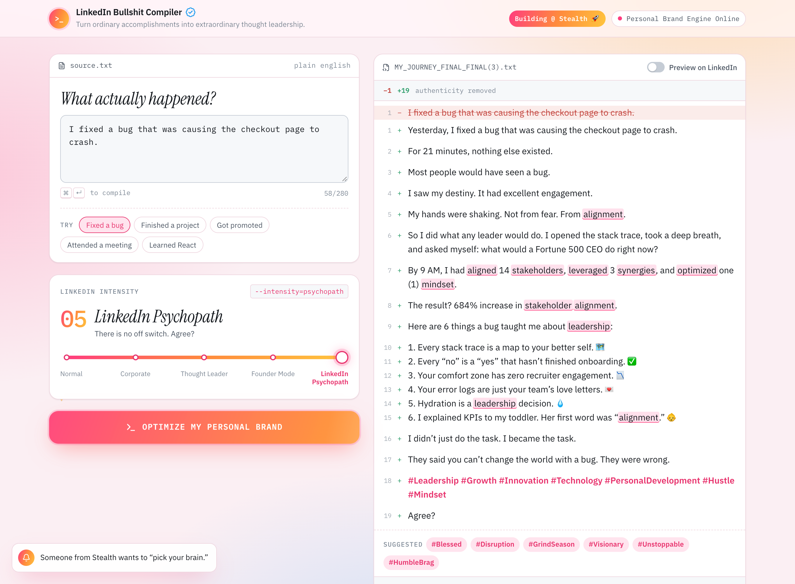

# LinkedIn Bullshit Compiler

> Turn ordinary accomplishments into extraordinary thought leadership.

Paste a normal sentence about something you did at work. Pick how unbearable you'd like to become. Compile. The app rewrites your sentence as increasingly ridiculous LinkedIn content, and the interface gets more insufferable along with it.



## Features

- **Five intensity levels:** Normal → Corporate → Thought Leader → Founder Mode → LinkedIn Psychopath. Each level has its own writing style.
- **An interface that degrades on purpose:** it starts as a quiet developer tool. Higher levels bring corporate blue, sunrise gradients, a serif that has read one Seneca quote, a `Building @ Stealth 🚀` badge, floating rockets, fake notifications, and a self-verified checkmark.
- **Fake compilation:** a terminal-style sequence (`> Removing authenticity...`) that adds extra steps at higher levels and runs for about 2 seconds.
- **Diff-view output:** your original sentence is struck through in red, and the compiled post appears in green with line numbers.
- **Buzzword detection:** corporate buzzwords are highlighted, and each one has a tooltip (*Synergy: "Meaning unclear. Sounds expensive."*).
- **Post analysis:** a Cringe Score meter, plus counts of buzzwords, humble brags, leadership references, and unnecessary life lessons. It also estimates recruiter engagement and how much authenticity remains.
- **LinkedIn-style preview:** a parody post card with fake engagement that gets absurd at high levels, and comments from a recruiter and a "CEO somewhere".
- **Copy, Compile Again, Reset:** Copy Post confirms with "Copied. Go inspire your network."
- **Easter eggs:** mentioning AI, meetings, coffee, a layoff (handled kindly), or typing a one-word input all trigger special behavior. There are also achievements at 5 and 10 compiles.
- **Responsive and accessible:** works on mobile, supports keyboard navigation (<kbd>⌘</kbd>/<kbd>Ctrl</kbd> + <kbd>Enter</kbd> compiles), and respects `prefers-reduced-motion`.

## Tech stack

- [React](https://react.dev) 19
- [Vite](https://vite.dev)
- JavaScript and plain CSS, using custom-property design tokens per intensity level
- [Lucide](https://lucide.dev) icons
- No backend and no API key. All generation runs locally.

## Getting started

```bash
npm install
npm run dev
```

Then open the URL Vite prints (usually http://localhost:5173).

To create a production build:

```bash
npm run build
npm run preview
```

## Project structure

```
src/
├── App.jsx                  # State and flow: input → compile → result
├── components/
│   ├── Header.jsx           # Title, status pill, stealth badge
│   ├── InputPanel.jsx       # Textarea, character count, example prompts
│   ├── IntensitySlider.jsx  # Five-level slider
│   ├── CompileButton.jsx    # OPTIMIZE MY PERSONAL BRAND
│   ├── Compiler.jsx         # Fake terminal compilation sequence
│   ├── OutputPanel.jsx      # Diff view, actions, preview toggle
│   ├── HighlightedText.jsx  # Buzzword highlighting and hashtags
│   ├── LinkedInPreview.jsx  # Parody social post card
│   ├── AnalyticsPanel.jsx   # POST ANALYSIS: cringe meter and stats
│   ├── AchievementToast.jsx
│   ├── LevelEffects.jsx     # Level 5 rockets and fake notifications
│   └── Footer.jsx
├── lib/
│   ├── generator.js         # compilePost(text, level): the swappable engine
│   ├── corpus.js            # Hooks, lessons, metrics, hashtags, easter eggs
│   ├── analytics.js         # Cringe score and stats
│   ├── buzzwords.js         # Buzzword patterns and tooltips
│   └── levels.js            # Per-level UI config, examples, compile steps
└── styles/
    ├── tokens.css           # Design tokens and per-level overrides
    └── base.css             # Reset, layout, shared primitives
```

The generation logic is isolated in `src/lib/generator.js` behind a single function, `compilePost(text, level)`. It can be replaced with an LLM call without touching the UI.

## Future improvements

- Real LLM-powered transformations
- Shareable generated post URLs
- Custom LinkedIn personas
- Downloadable post cards
- Leaderboard for highest cringe score

---

<sub>This is a parody. It isn't affiliated with or endorsed by LinkedIn. No thought leaders were harmed in the compilation of this project.</sub>
